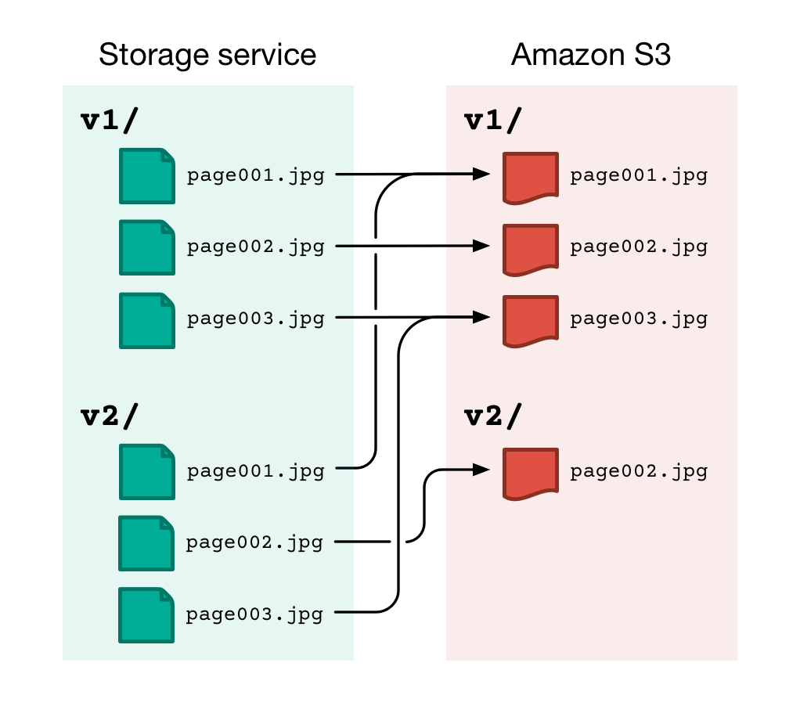
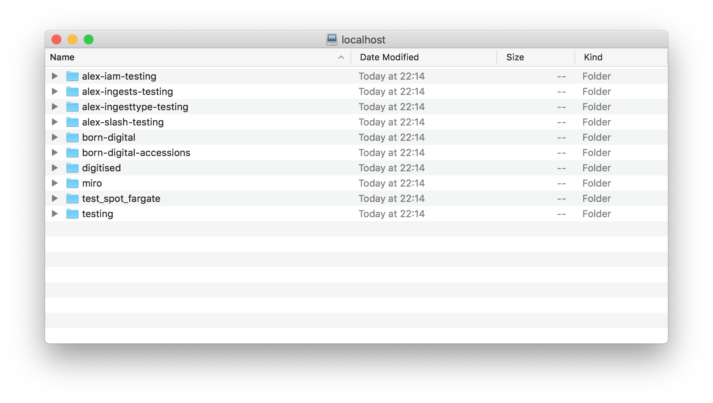
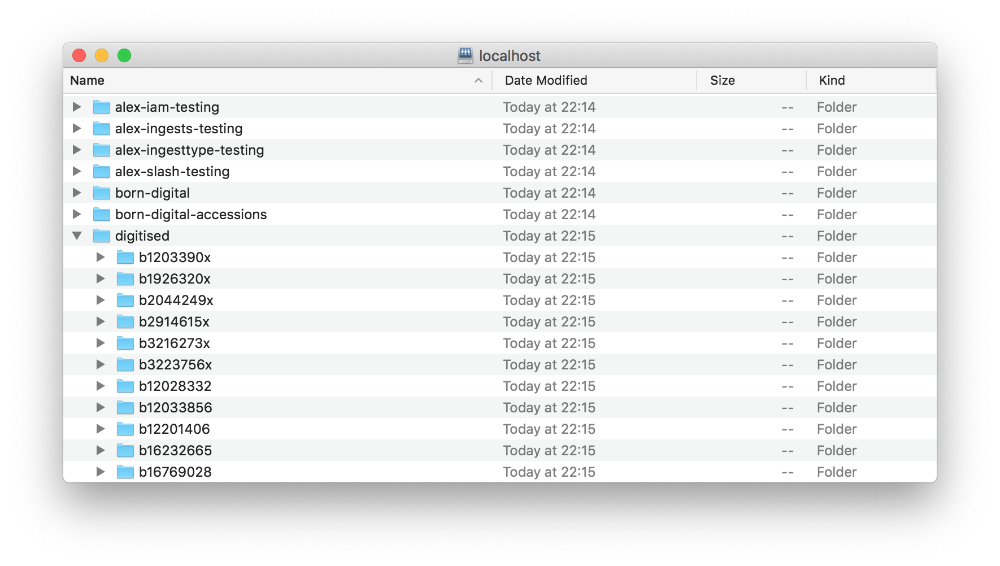
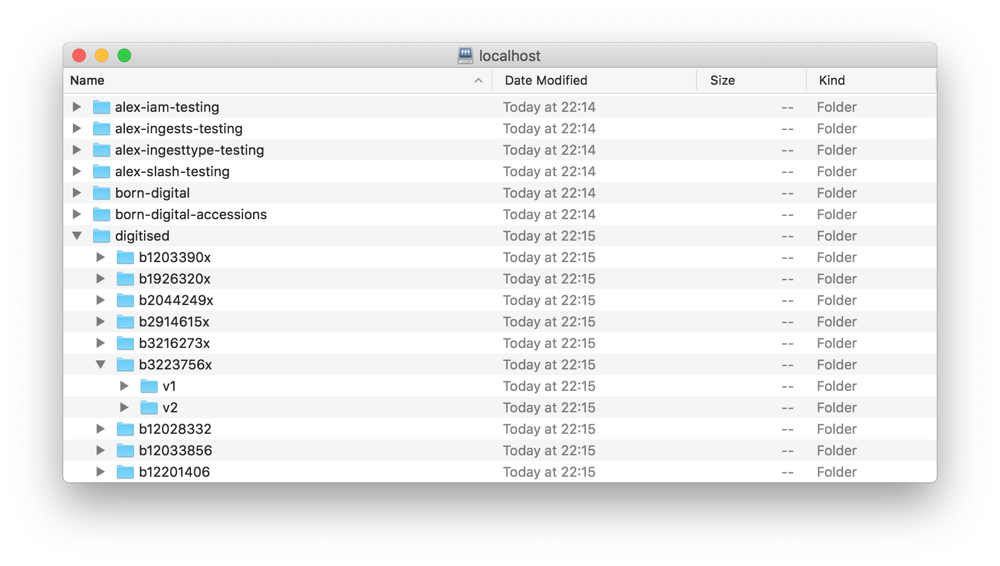
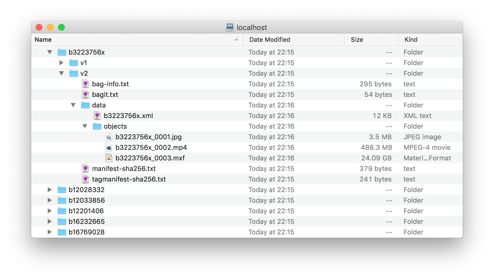

# storage-service-webdav

This is some experimental code that creates a WebDAV server for browsing the virtual filesystem used by the [Wellcome storage service](https://github.com/wellcomecollection/storage-service).


## Why build this?

The storage service uses Amazon S3 and Azure Blob Storage as the underlying storage, but there's not a 1:1 mapping between files in the storage service and the object stores.

A bag in the storage service can have multiple "versions".
To reduce the number of objects we need to store, a new version of a bag can refer to objects in a previous version of a bag.
The file appears in two different bag versions, but only once in the object storage.
This reduces our storage costs.

For example, suppose we digitise a book, with one image per page.
If we later have to redigitise a single page, the new version of the bag can contain the single new image, rather than duplicating all the previous pages.

Here's a simple example:



(For more on how versioning works, read [*How we store multiple versions of BagIt bags*](https://stacks.wellcomecollection.org/how-we-store-multiple-versions-of-bagit-bags-e68499815184).)

For computers talking to the storage service, this is a non-issue.
The storage service resolves the correct paths for you in the bags API.
When you request a bag from the API, it includes the exact S3 paths where you can find each file.
In the example, that would be `v1/page001.jpg`, `v2/page002.jpg`, `v1/page003.jpg`.

For humans browsing the underlying object storage, it's less obvious.
Although it's possible to find all the files -- either by looking at responses from the bags API, or reading the [fetch files in the bag](https://tools.ietf.org/html/rfc8493#section-2.2.3) -- it's more work.
In the example, if you looked in the `v2/` prefix in S3, you'd see a single file, even though the bag contains three files.

The code in this repo creates a WebDAV server that presents the files as seen by the storage service.
For example, looking in the `v2/` prefix would show all three files -- and downloading them would get the correct file contents from S3.

I don't expect we'll ever use this in prodcution, but I wanted to see if it was possible.


## How does it work?

The heavy lifting is done [WsgiDAV](https://pypi.org/project/WsgiDAV/), a Python library that includes a WebDAV server implementation.
The library allows creating [custom providers](https://wsgidav.readthedocs.io/en/latest/user_guide_custom_providers.html) -- that is, a way to connect to custom storage providers and present them through a WebDAV interface.
Examples include a Mercurial repository, a MySQL database, and Google Bigtable.

One of the examples is a [browseable, multi-categorised resource tree](https://wsgidav.readthedocs.io/en/latest/addons-virtual.html).
This example allows a file to appear at multiple points in the hierarchy -- depending on how you're browsing the categories.
This is exactly what I wanted to do!

I found the source code [in the WsgiDAV repository](https://github.com/mar10/wsgidav/blob/2e375551f1961380d7afd2cbcf3bef32bb98b8d7/wsgidav/samples/virtual_dav_provider.py).
It uses hard-coded data; I modified the example to dynamically fetch data from the storage service and S3.

Some of the data comes directly from the storage service APIs; some of it comes from an Elasticsearch cluster where we index the storage service metadata.


## How do I run it?

1.  Get local AWS credentials for the Wellcome Digital Platform account, and credentials for the storage service at `~./wellcome-storage/oauth-credentials.json`.

2.  Install Python 3, and install the dependencies:

    ```
    pip3 install -r requirements.txt
    ```

3.  Run the main script:

    ```
    python3 run.py
    ```

4.  In your WebDAV client of choice, open <http://localhost:8875>.

    Your'e no

    e.g. in the macOS Finder, select **Go** > **Connect to Server**.
    Enter <http://localhost:8875> as the URL, then click **Connect**.
    When prompted, click **Confirm** to allow an unsecured connection.
    Then, select **Connect As Guest**.


## What will I see?

At the top level, you see all the spaces in the storage service:



If you drill down a layer, you see all the external identifiers in a particular space:



(Note: identifiers that contain slashes will be collapsed so they appear as a single directory in this list.)

If you look inside an external identifier, you see all the versions of that (space, external identifier) pair:



If you drill down into a version directory, you can browse and download all the files in the bag.




## What happens next?

I wrote this code as an experiment to see if it was possible, rather than as an idea I expect us to use in production.

This code has a number of limitations, edge cases, and probably bugs.
I don't expect to invest any serious development time in making it robust.

I'm sharing the code for interest and as a technical curiosity, not as something you should try to use directly.


## Further reading

-   [How we store multiple versions of BagIt bags](https://stacks.wellcomecollection.org/how-we-store-multiple-versions-of-bagit-bags-e68499815184), by me (Alex Chan), which explains more about how and why we version bags this way.

-   The [documentation for WsgiDAV](https://wsgidav.readthedocs.io/en/latest/), which is what makes this experiment possible.

-   [A New Open Source Virtual File System – running on Windows in User mode!](https://www.youtube.com/watch?v=tDUL3wEs2ew), by James Cain at ACCU 2019.
    I saw this talk in-person (back when in-person conferences were a thing), and it gave me the idea to create a concrete implementation of the storage service's virtual filesystem.


## License

MIT.
